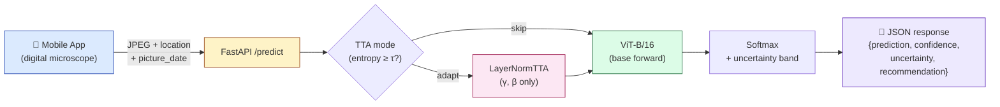
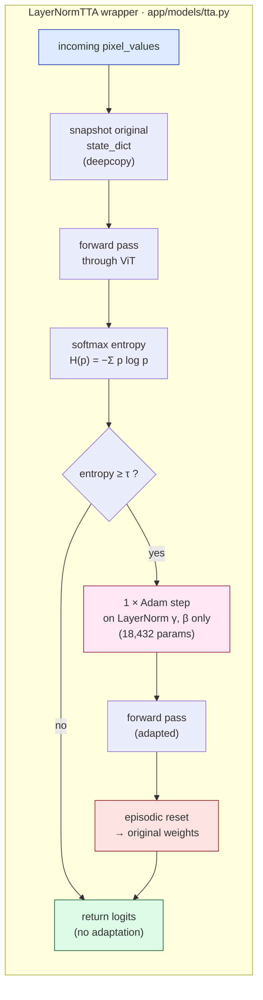

<div align="center">

# 🔬 MoleScan Backend

### *Dermoscopy mole classification API for the MoleScan mobile app*

[](https://www.python.org/)
[](https://fastapi.tiangolo.com/)
[](https://pytorch.org/)
[](https://huggingface.co/transformers)
[](LICENSE)
[]()
[]()

**Fine-tuned ViT-B/16 · LayerNorm Test-Time Adaptation · Dockerized · uv-managed**

[Quick Start](#-quick-start) •
[API](#-api-reference) •
[Method](#-method) •
[Training](#-training) •
[References](#-references)

</div>

---

## 📖 About

MoleScan is a clinical-decision-support backend that classifies dermoscopy
images of skin moles into three categories: **healthy**, **suspicious**,
and **malignant**. The mobile companion app (built separately) captures
images via a digital microscope attachment and sends them here for
inference.

The model is a **ViT-B/16** fine-tuned on the **ISIC 2019** dataset. At
inference time, predictions are routed through a **LayerNorm-only entropy
minimization** wrapper to compensate for the distribution shift between
ISIC's clinical dermoscopy images and the mobile app's microscope captures.

> **Supervisor:** Prof. Balázs Harangi · University of Debrecen
> **Target venue:** CITDS 2026 · Submission deadline: **31 May 2026**

---

## 🚦 Status

| Component | State |
|---|---|
| FastAPI backend skeleton | ✅ Complete |
| ViT model loading + LayerNorm TTA wrapper | ✅ Complete |
| `/health` and `/predict` endpoints | ✅ Complete |
| Dockerfile for faculty-server deployment | ✅ Complete |
| ISIC 2019 fine-tuning pipeline (Kaggle) | ✅ Code ready |
| Fine-tuned weights | ⏳ Awaiting training run |
| Calibration of `TTA_ENTROPY_THRESHOLD` | 🔜 After training |
| Mobile-microscope shift evaluation | 🔜 After mobile pilot data |
| Faculty-server deployment | 🔜 |
| CITDS paper draft | 🔜 |

---

## 🏗️ System Architecture



**Three classes:** `healthy` · `suspicious` · `malignant`
*(mapped from ISIC 2019's eight clinical labels — see [Method](#-method))*

---

## 🚀 Quick Start

> **Prerequisites:** Python 3.11, [uv](https://github.com/astral-sh/uv), Git, [GitHub CLI](https://cli.github.com/) (optional)

### Windows / PowerShell

```powershell
# 1. Clone the repository
git clone https://github.com/asfandyar-prog/molescan-backend.git
cd molescan-backend

# 2. Create the virtual environment
uv venv --python 3.11
.venv\Scripts\Activate.ps1

# 3. Install dependencies
uv pip install -e ".[dev]"

# 4. Configure environment
Copy-Item .env.example .env

# 5. Run the server
uvicorn app.main:app --reload --port 8000
```

Then open **<http://localhost:8000/docs>** for the interactive Swagger UI.

<details>
<summary><b>Linux / macOS</b></summary>

```bash
git clone https://github.com/asfandyar-prog/molescan-backend.git
cd molescan-backend
uv venv --python 3.11 && source .venv/bin/activate
uv pip install -e ".[dev]"
cp .env.example .env
uvicorn app.main:app --reload --port 8000
```

</details>

---

## 🔌 API Reference

| Method | Path | Description |
|---|---|---|
| `GET` | `/health` | Liveness / readiness probe |
| `POST` | `/predict` | Classify a mole image |
| `GET` | `/docs` | Interactive Swagger UI |
| `GET` | `/redoc` | ReDoc alternative documentation |

### `POST /predict`

**Request** — `multipart/form-data`:

| Field | Type | Description |
|---|---|---|
| `file` | image (JPEG / PNG / WebP) | Mole image from the mobile microscope |
| `location` | string | Body location, e.g. `"left forearm"` |
| `picture_date` | date (`YYYY-MM-DD`) | Capture date |

**Response** — `application/json`:

```json
{
  "prediction": "suspicious",
  "confidence": 0.7821,
  "uncertainty": "medium",
  "recommendation": "This mole shows features that warrant professional evaluation. Please book a dermatology appointment within 4 weeks.",
  "location": "left forearm",
  "picture_date": "2026-04-30"
}
```

<details>
<summary><b>Confidence → uncertainty mapping</b></summary>

| Confidence | Uncertainty | Configured by |
|---|---|---|
| `≥ 0.85` | `low` | `CONFIDENCE_HIGH` |
| `0.60 – 0.85` | `medium` | `CONFIDENCE_MEDIUM` |
| `< 0.60` | `high` | (default) |

</details>

---

## 🐳 Docker

```powershell
docker build -t molescan-backend .
docker run -p 8000:8000 -v ${PWD}/weights:/app/weights molescan-backend
```

The `weights/` directory is mounted as a volume so the fine-tuned `.pt`
file can be updated without rebuilding the image.

---

## 📁 Project Structure

```
molescan-backend/
├── app/
│   ├── main.py                    # FastAPI app + lifespan (model loads on startup)
│   ├── core/
│   │   └── config.py              # Pydantic settings, .env-driven
│   ├── api/routes/
│   │   ├── health.py              # GET /health
│   │   └── predict.py             # POST /predict + recommendation copy
│   ├── models/
│   │   ├── classifier.py          # MoleScanClassifier singleton
│   │   └── tta.py                 # LayerNormTTA — faithful thesis port
│   └── schemas/
│       └── prediction.py          # Pydantic request / response models
├── training/
│   ├── train_isic.py              # Kaggle ISIC 2019 fine-tuning script
│   └── README.md                  # Kaggle setup instructions
├── weights/                       # .pt files (git-ignored)
├── pyproject.toml                 # uv-managed dependencies
├── Dockerfile                     # Multi-stage faculty-server image
└── .env.example                   # Configuration template
```

---

## 🧠 Method

### Base classifier

ViT-B/16 (`google/vit-base-patch16-224`) fine-tuned on **ISIC 2019**, with
the original 8 clinical labels collapsed to 3 MoleScan categories:

| MoleScan | ISIC 2019 source classes |
|---|---|
| `healthy` | NV (nevus), BKL (benign keratosis), DF (dermatofibroma), VASC (vascular) |
| `suspicious` | AK (actinic keratosis), BCC (basal cell carcinoma) |
| `malignant` | MEL (melanoma), SCC (squamous cell carcinoma) |

Standard fine-tuning recipe — AdamW (lr 5e-5), cosine LR schedule with
10% warmup, weighted cross-entropy (inverse-frequency class weights),
mild augmentation (flips, rotation, color jitter). No mixup / cutmix —
they create implausible mole images that can mislead a medical model.
See [`training/train_isic.py`](training/train_isic.py).

### Test-Time Adaptation



The TTA mechanism is **TENT** (Wang et al., ICLR 2021), with the
LayerNorm extension following **TTT++** (Liu et al., NeurIPS 2021). Only
the LayerNorm γ/β affine parameters are updated — for ViT-B/16 this is
**18,432 parameters (≈0.02% of the 86M backbone)**. The implementation
([`app/models/tta.py`](app/models/tta.py)) is a faithful port of the
thesis code and pins the canonical hyperparameters from Appendix A.1 of
the thesis: Adam, lr 1e-4, 1 step per batch, episodic reset.

### What this work actually contributes

The TTA mechanism is **not novel** — it is a direct application of TENT
extended to ViT LayerNorm following TTT++. The contribution this paper
will make is yet to be settled empirically, with the candidates being:

  - **(a)** measured F1 + ECE recovery on the specific mobile-microscope
    vs ISIC distribution shift, with calibration numbers the source TTA
    literature underreports;
  - **(b)** the **batch-size-1 deployment fix** (see below) — TENT/TTT++
    assume batched test loaders; production inference does not;
  - **(c)** the integrated production system as a system-paper contribution.

These will be settled once experiments are run. **No accuracy claims are
made in this README until the numbers exist.**

### Batch-size-1 deployment fix

Entropy minimization on a batch of size 1 is degenerate — the model can
drive entropy to zero by collapsing to any one class. The thesis adapts
on full test loaders; a FastAPI endpoint receives one image at a time.

The current default uses **option (c) from a documented set of three**:
a high `TTA_ENTROPY_THRESHOLD` so confident solo requests skip
adaptation entirely and only highly uncertain inputs trigger TTA. Until
the threshold is empirically calibrated against fine-tuned weights, it
is set to `99.0` (effectively disabling adaptation), making the system
safe-by-default — the base ViT serves every request.

---

## 🎓 Training

End-to-end ISIC 2019 fine-tuning runs on a free Kaggle GPU. Output is a
~340 MB `.pt` file that drops into the backend's `weights/` directory.

| | |
|---|---|
| **Script** | [`training/train_isic.py`](training/train_isic.py) |
| **Setup guide** | [`training/README.md`](training/README.md) |
| **GPU** | Kaggle Tesla T4 / P100 (free, 30 hrs/week) |
| **Expected runtime** | ~5–10 hours (10 epochs, batch 32) |
| **Outputs** | `molescan_vit.pt`, `training_history.json`, `final_metrics.json`, `confusion_matrix.png` |

---

## ⚙️ Configuration

All settings live in `.env` (template: [`.env.example`](.env.example)).

<details>
<summary><b>Key knobs</b></summary>

| Variable | Default | Description |
|---|---|---|
| `MODEL_CHECKPOINT` | `google/vit-base-patch16-224` | HF checkpoint to load before fine-tuned weights |
| `MODEL_WEIGHTS_PATH` | `weights/molescan_vit.pt` | Path to fine-tuned state_dict |
| `TTA_ENABLED` | `true` | Master switch for the LayerNorm TTA wrapper |
| `TTA_LEARNING_RATE` | `1e-4` | Thesis-canonical, do not change without an ablation |
| `TTA_STEPS` | `1` | Thesis-canonical |
| `TTA_EPISODIC` | `true` | Reset weights after every batch |
| `TTA_ENTROPY_THRESHOLD` | `99.0` | Safe default — only adapt on extremely uncertain inputs |
| `CONFIDENCE_HIGH` | `0.85` | Maps confidence → `low` uncertainty |
| `CONFIDENCE_MEDIUM` | `0.60` | Maps confidence → `medium` uncertainty |

</details>

---

## 📚 References

The TTA-relevant works cited in the thesis bibliography (and only those —
no citations beyond what has actually been read):

| # | Reference |
|---|---|
| [1] | Wang et al., **TENT: Fully Test-Time Adaptation by Entropy Minimization**, *ICLR 2021*. [arxiv:2006.10726](https://arxiv.org/abs/2006.10726) |
| [2] | Liu et al., **TTT++: When Does Self-Supervised Test-Time Training Fail or Thrive?**, *NeurIPS 2021*. [arxiv:2106.01890](https://arxiv.org/abs/2106.01890) |
| [3] | Sun et al., **Test-Time Training with Self-Supervision for Generalization under Distribution Shifts**, *ICML 2020*. [arxiv:1909.13231](https://arxiv.org/abs/1909.13231) |
| [4] | Guo et al., **On Calibration of Modern Neural Networks**, *ICML 2017*. [arxiv:1706.04599](https://arxiv.org/abs/1706.04599) |
| [5] | Dosovitskiy et al., **An Image is Worth 16x16 Words: Transformers for Image Recognition at Scale**, *ICLR 2021*. [arxiv:2010.11929](https://arxiv.org/abs/2010.11929) |

---

## 🙏 Acknowledgments

- **Prof. Balázs Harangi** — University of Debrecen, project supervision
- **Saw** — MoleScan mobile app development
- The TTA wrapper is ported from the author's BSc thesis:
  *Predictive Self-Supervised Vision Transformers under Test-Time
  Distribution Shifts with Lightweight TTA*, University of Debrecen, 2026
- ViT pretrained weights from [Google Research](https://huggingface.co/google/vit-base-patch16-224)
- ISIC 2019 dataset — [International Skin Imaging Collaboration](https://www.isic-archive.com/)

---

<div align="center">

**Asfand Yar** · [@asfandyar-prog](https://github.com/asfandyar-prog)

*Built for CITDS 2026* · *MIT Licensed*

</div>